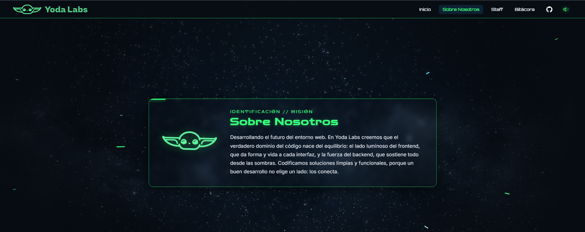
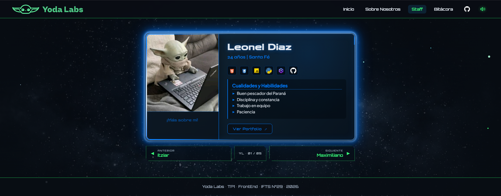
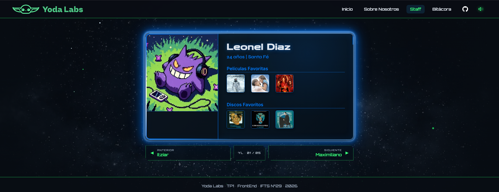
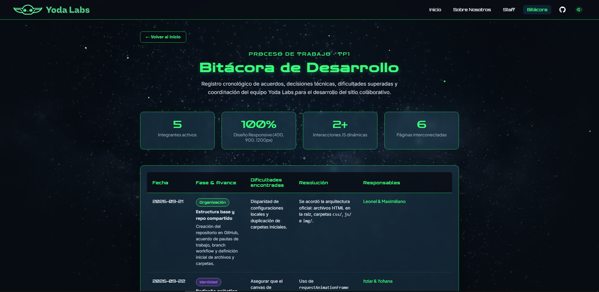
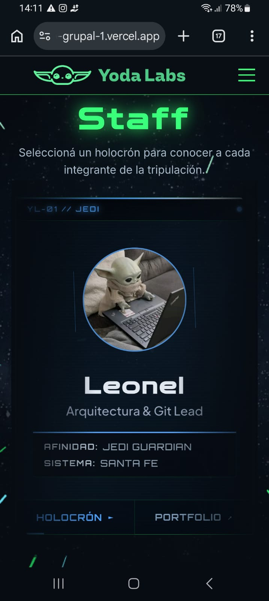

# Yoda Labs - Trabajo Práctico Grupal 1

Sitio web oficial de **Yoda Labs**, desarrollado para el Trabajo Práctico Grupal 1 de la materia **Desarrollo de Sistemas Web Front End (2026 · 2do Cuatrimestre)** de la Tecnicatura Superior (IFTS N°29).

El proyecto presenta al equipo, expone sus propósitos y filosofía técnica, despliega perfiles individuales interactivos enriquecidos con animaciones y contenidos multimedia, y documenta integralmente el proceso en una bitácora de desarrollo.

---

## Integrantes del Equipo

- **Leonel Diaz** - Santa Fe | GitHub: [LeonelDiaz225](https://github.com/LeonelDiaz225) | Portfolio: [repo-front-phi.vercel.app](https://repo-front-phi.vercel.app/)
- **Maximiliano Millan** - Buenos Aires | GitHub: [Plecto](https://github.com/estoesplecto) | Portfolio: [mmillan.vercel.app](https://mmillan.vercel.app/)
- **Itziar Urriola** - Buenos Aires | GitHub: [Itz-U](https://github.com/itziarurriola) | Portfolio: [pfo-1-portfolio-itziar-urriola.vercel.app](https://pfo-1-portfolio-itziar-urriola.vercel.app/)
- **Yohana Olivera** - Tucumán | GitHub: [Yohana Olivera](https://github.com/YohaOlivera) | Portfolio: [yohaolivera.github.io/pfo-portfolio-yohana](https://yohaolivera.github.io/pfo-portfolio-yohana/)
- **Melisa Solano** - Buenos Aires | GitHub: [Melisa Solano](https://github.com/melulu169) | Portfolio: [portfolio-melisa.vercel.app](https://portfolio-melisa.vercel.app/)

---

## Tecnologías Utilizadas

- **HTML5 Semántico:** estructura accesible, encabezados, navegación bidireccional y páginas de perfiles.
- **CSS3 Moderno:** variables personalizadas (`:root`), flexbox, CSS grid, transformaciones y transiciones 3D (`perspective`, `rotateY`, `backface-visibility`), diseño adaptativo y personalización de barras de desplazamiento.
- **JavaScript (Vanilla):**
  - Animación de partículas estelares en `<canvas>` 2D con simulación de profundidad tridimensional (`z-index: -1`, `requestAnimationFrame`).
  - Detección de desplazamiento (`scroll`) y observador de intersección (`IntersectionObserver`) para visibilidad y fijación dinámica de encabezado.
  - Interacción táctil/clic en tarjetas de integrantes con efecto _Flip 3D_ para conmutar datos personales y multimedia favorita.
- **Google Fonts:**
  - _Space Grotesk_ (títulos principales y botones).
  - _Inter_ (cuerpo de texto y legibilidad general).
  - _Orbitron_ (navegación y pie de página).
  - _Syne_ (nombres y subtítulos).
  - _Plus Jakarta Sans_ (roles y textos secundarios).
  - _Zen Dots_ (detalles futuristas y títulos destacados).
- **Iconografía & Recursos:** imágenes y logotipos optimizados en formato WebP/PNG/JPG representativos del universo espacial y temático del equipo.

---

## Estructura de Archivos y Carpetas

```text
Front-Trabajo_Practico_Grupal_1/
├── index.html              # Portada principal: hero, propósito y staff de integrantes
├── README.md               # Documentación general y técnica del proyecto
├── css/
│   ├── style.css           # Estilos globales, canvas espacial, portada y media queries
│   ├── perfiles.css        # Sistema de tarjetas Flip 3D, galerías y perfiles
│   └── bitacora.css        # Estilos, tablas y tarjetas de la sección bitácora
├── js/
│   ├── main.js             # Motor de canvas espacial, estrellas y scroll/header reactivo
│   └── perfiles.js         # Controlador del giro interactivo 3D en las tarjetas
├── img/                    # Avatares, portadas de películas, discos y logotipos
└── pages/
    ├── bitacora.html       # Bitácora oficial: métricas, fases, acuerdos y dificultades
    ├── leonel.html         # Perfil individual de Leonel Diaz
    ├── maximiliano.html    # Perfil individual de Maximiliano Millan
    ├── itziar.html         # Perfil individual de Itziar Urriola
    ├── yohana.html         # Perfil individual de Yohana Olivera
    └── melisa.html         # Perfil individual de Melisa Solano
```

---

## Guía de Estilos e Identidad Visual

La identidad visual está inspirada en la dualidad y equilibrio del desarrollo web bajo la temática espacial de **Yoda Labs**:

### Paleta de Colores

- **Fondo Espacial:** `#090D14` (profundidad oscura del universo).
- **Verde Yoda (Luz):** `#58C98B` (acento principal, títulos y estados activos).
- **Verde Fuerza:** `#418576` (bordes sutiles, divisiones y detalles).
- **Azul Labs:** `#214358` (superficies de tarjetas y estados _hover_ de navegación).
- **Texto Claro:** `#E2E8F0` (alta legibilidad y contraste óptimo).

_Acentos personalizados por integrante:_

- Leonel: `#007bff` (Azul luminoso).
- Maximiliano: `#ff9900` (Naranja estelar).
- Yohana: `#ff66b2` (Rosa nébula).
- Melisa: `#e63c3c` (Rojo sith/cristal kyber).
- Itziar: `#b266ff` (Violeta fuerza).

### Breakpoints Adaptativos (Responsive Design)

El proyecto implementa los breakpoints obligatorios de la consigna para garantizar una visualización sin desbordes:

- **`400px` (Móviles / Small screens):** espaciados compactos, una sola columna para tarjetas y adaptación vertical de componentes sin recortes.
- **`900px` (Tablets / Dispositivos medianos):** reorganización de la grilla de staff en 3 columnas y vista adaptada para la tarjeta de perfil.
- **`1200px` (Escritorio / Grandes resoluciones):** grilla de 5 integrantes en una sola fila panorámica y contenedores con márgenes holgados.

---

## Funciones JavaScript

### 1. Canvas Estelar Tridimensional y Aceleración Espacial (`js/main.js`)

Genera más de 220 partículas estelares calculando su posición tridimensional `(x, y, z)` y velocidad relativa con respecto al centro de la ventana. Incorpora un motor de **velocidad variable continua**:

- **Velocidad base:** desplazamiento fluido en la parte superior.
- **Aceleración progresiva por profundidad (_Scroll Depth_):** a medida que el usuario desciende en la página, la velocidad se incrementa exponencialmente hasta alcanzar el hiperespacio (las estrellas se estiran en rayos lumínicos _hyperspace streaks_).
- **Inercia cinemática:** suavizado en cada cuadro que brinda sensación de peso y aceleración real de nave espacial.

### 2. Header Reactivo al Desplazamiento (`js/main.js`)

Controla la aparición suave del texto de descripción con `IntersectionObserver` y monitorea el scroll vertical para acoplar inmediatamente el navbar fijo en la parte superior apenas el usuario inicia el desplazamiento hacia abajo (`scrollY > 40px`).

### 3. Tarjeta Interactiva Flip 3D en cada perfil (`js/perfiles.js`)

El archivo se carga en `leonel.html`, `maximiliano.html`, `yohana.html`, `melisa.html` e `itziar.html`. En cada perfil agrega un evento de clic a la tarjeta `#tarjeta-perfil` y conmuta la clase `.girada`. Esto realiza una rotación de 180° sobre el eje Y con perspectiva 3D y permite alternar entre la presentación, las habilidades y la multimedia favorita de cada integrante.

### 4. Carrusel Infinito JS Nativo (js/main.js)

Crea un slider continuo para las tarjetas del equipo mediante `requestAnimationFrame`. Evita la contaminación del DOM (no utiliza clones de nodos) y, matemáticamente, reubica la primera tarjeta al final cuando sale completamente del área visible, compensando la transformación del track para lograr un loop visualmente perfecto y con pausa inteligente al hacer hover.

### 5. Navegación Móvil Hamburguesa & ScrollSpy (js/main.js)

Implementa un menú desplegable responsivo (para <768px) que se oculta mediante clip-path para animaciones fluidas, y cuenta con cierre automático al hacer clic en enlaces internos. Adicionalmente, IntersectionObserver colorea de verde dinámicamente el enlace activo de la barra superior conforme el usuario escrolea las secciones.

### 6. Sistema de Audio Espacial Interactivo (js/main.js)

Integra el tema principal (`song/theme.mp3`) respetando las políticas de navegadores: controla el mute y la reproducción en bucle mediante el botón de sonido de la barra de navegación, que actualiza dinámicamente su SVG para indicar si el audio está activo o pausado.

### 7. Funciones compartidas en cada perfil

Todos los perfiles de `pages/` comparten la navegación hacia la portada, la bitácora y los demás integrantes. Además, cada uno utiliza:

- Una tarjeta Flip 3D para mostrar y ocultar información personal.
- Galerías enlazadas de películas y discos favoritos.
- El botón de sonido compartido para controlar el audio espacial.
- Navegación anterior, siguiente y retorno al staff.

## Capturas de pantalla

Las siguientes capturas muestran las principales vistas e interacciones del proyecto:

### Portada



### Perfil de Leonel



### Perfil girado



### Bitácora

La bitácora es una página extensa, por eso se incluye una captura representativa de su encabezado, métricas y tabla de seguimiento.



### Diseño responsive



---

## Sección Bitácora de Desarrollo

Accesible desde el menú principal (`pages/bitacora.html`), recopila el historial real del equipo:

- **Organización y Arquitectura:** acuerdos iniciales y repositorio.
- **Identidad Visual y Canvas:** diseño galáctico y desarrollo de animaciones.
- **Perfiles y Tarjetas 3D:** unificación de fichas de integrantes, películas y música.
- **Consolidación y Navegación:** validación cruzada de enlaces, botones internos de navegación y responsive design.

---

## Uso de Inteligencia Artificial y Criterio de Autoría

Conforme a la consigna del trabajo práctico:

- **Herramientas y Modelos Utilizados:** Asistente técnico impulsado por modelos avanzados de lenguaje (Gemini / Claude) en planes estándar.
- **Ámbitos de Asistencia:** Colaboró en la generación de fórmulas matemáticas para la proyección de perspectiva del canvas espacial, sugerencias de sintaxis CSS moderna para transformaciones 3D, y redacción de borradores de la documentación técnica.
- **Criterio de Adaptación y Autoría:** Cada línea de código e interacción generada fue revisada línea por línea, adaptada a la estética propia de **Yoda Labs**, testeada en diferentes resoluciones y validada en su integración con la estructura del sitio por los integrantes del equipo. Las decisiones temáticas, la selección de contenidos personales y el control de diseño final corresponden enteramente al equipo de estudiantes.

---

## Publicación

- **Repositorio de GitHub:** [LeonelDiaz225/Front-Trabajo_Practico_Grupal_1](https://github.com/LeonelDiaz225/Front-Trabajo_Practico_Grupal_1.git)
- **Despliegue en Vercel:** [front-trabajo-practico-grupal-1.vercel.app](https://front-trabajo-practico-grupal-1.vercel.app/)

---

## Evolución y ampliaciones para próximos trabajos

Para futuras entregas se podrían incorporar las siguientes mejoras:

- Agregar un formulario de contacto con validación de datos.
- Incorporar un sistema de filtros para buscar integrantes por habilidades o tecnologías.
- Reemplazar el contenido estático por datos cargados desde un archivo JSON o una API.
- Mejorar la accesibilidad con navegación completa mediante teclado, foco visible y más atributos ARIA.
- Optimizar las imágenes y el audio para mejorar el rendimiento y los tiempos de carga.
- Añadir nuevas secciones, como proyectos del equipo, recursos compartidos o novedades.
- Incorporar pruebas de usabilidad y registrar los resultados en la bitácora.
